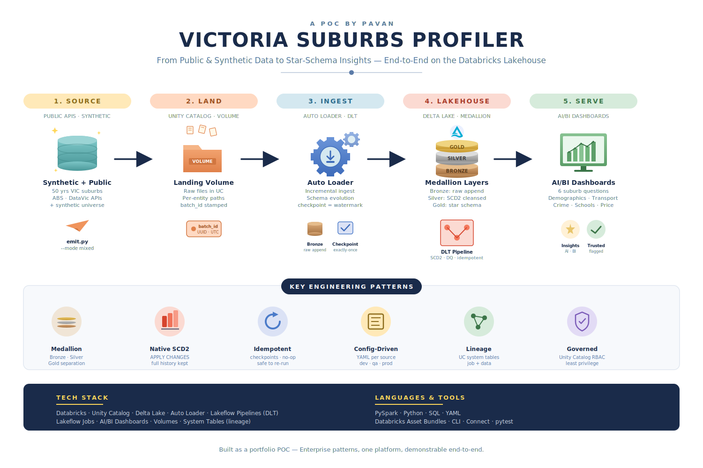
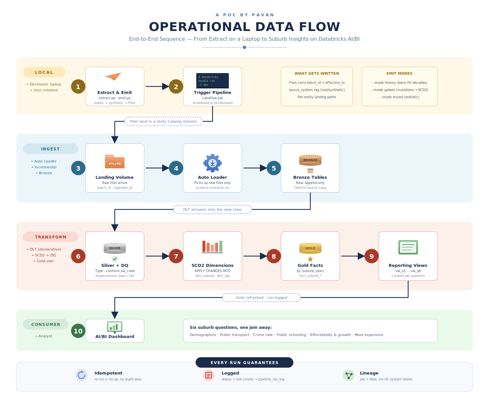
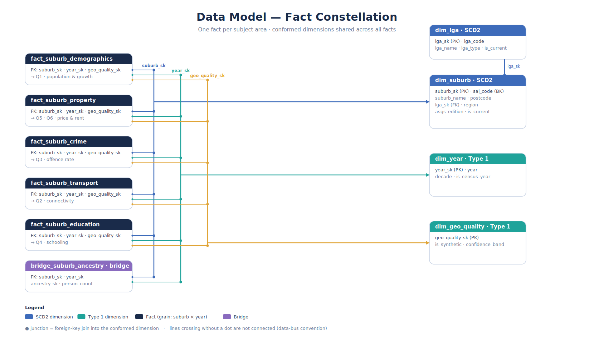
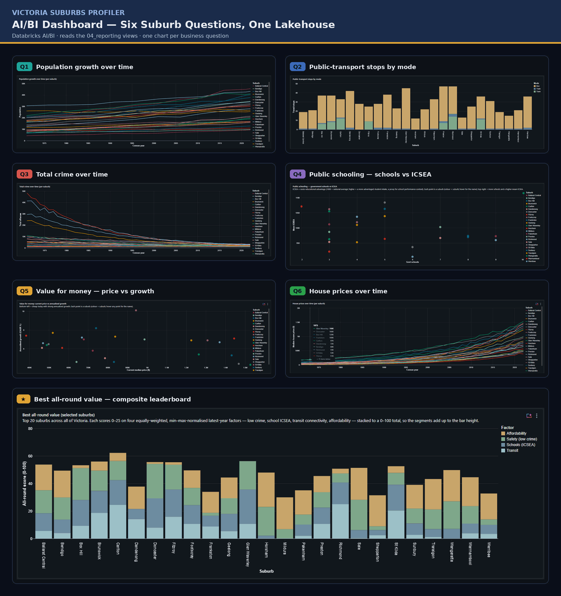

<div align="center">

# 🏙️ Victoria Suburbs Profiler

### *An Enterprise-Pattern Lakehouse POC — Profiling Every Suburb in Victoria, End-to-End on Databricks*

**Fifty years of suburb history turned into star-schema insight — with native SCD Type 2, idempotent incremental loading, config-driven data quality, lineage, and one-command deployment baked in from day one.**

<br>


<br>

[**Quickstart**](#-quickstart) · [**Architecture**](#-architecture) · [**Data Flow**](#-operational-data-flow) · [**Data Model**](#-data-model--gold-layer-fact-constellation) · [**Design Decisions**](#-design-decisions-worth-discussing) · [**Teardown**](#-teardown--destroy) · [**Author**](#-about-the-author)

</div>

---

## 📌 The Problem

Victoria has hundreds of suburbs, and the questions people ask about them — *where should I buy, where's safe, where are the good schools, where will prices grow* — span five very different subject areas — demographics, property, crime, transport, and schooling — each with its own geography, cadence, and quirks, and rarely stitched together across time. This project models all of them as one connected warehouse from a self-contained **synthetic universe**: a deterministic generator that produces ~50 years of plausible history for every suburb, so the full set of engineering patterns can be shown end-to-end with no external data setup.

This warehouse answers six questions about **every suburb in Victoria, across as much history as the data allows**:

- **How has each suburb grown** — population and demographics (age, income, household mix) over ~50 years?
- **Which suburbs have the best public-transport connectivity?**
- **Which suburbs have a low (overall) crime rate?**
- **Which suburbs have the best public schooling?**
- **Which suburbs are affordable *and* show growth potential?**
- **Which suburbs are the most expensive?**

Answering these in a production-grade way takes more than a notebook. It needs a **proper warehouse** — one that ingests raw data reliably, cleanses and historicises it correctly, models it for analytical querying, and serves it through curated views. With full SCD Type 2 history. With idempotent, restartable pipelines. With end-to-end traceability of every row.

This repository is that warehouse — a POC that deliberately adopts enterprise patterns to demonstrate production-readiness, not just "it runs on my laptop."

---

## ✨ Key Engineering Patterns Demonstrated

Every architectural choice maps to a real-world data-engineering pattern:

| Pattern | What It Does | Why It Matters |
|---|---|---|
| 🥉🥈🥇 **Medallion Architecture** | Bronze (raw) → Silver (cleansed, SCD2) → Gold (star schema) | Industry-standard separation of concerns for analytical data |
| 🌊 **Declarative Pipelines (DLT)** | Lakeflow Declarative Pipelines define tables, not imperative DML | The platform handles ordering, retries, incrementality, and metrics |
| 📚 **Native SCD Type 2** | `APPLY CHANGES INTO … STORED AS SCD TYPE 2` on the SCD2 dims | Full history without hand-written, bug-prone MERGE logic |
| ♻️ **Idempotent & Incremental** | Auto Loader + streaming tables process only new files/rows | Re-runs are safe; failed runs simply resume |
| 🚫 **NO_OP Detection** | A run with no new data is logged as a clean no-op | Proves the pipeline is *truly* idempotent, not "usually fine" |
| 🆔 **End-to-End Traceability** | One `batch_id` flows landing → Bronze → Silver → Gold | Join any Gold row back to the exact source file in seconds |
| 🔑 **Stable Surrogate Keys** | `xxhash64(business_key, __START_AT)` on every SCD2 dim; facts reuse the same formula | Fact↔dimension keys line up across all of history |
| ⚙️ **Config / Metadata-Driven** | Entities, schemas, and DQ rules live in YAML | Add a subject area by config, not by new pipeline code |
| 🔍 **Lineage & Observability** | Unity Catalog system tables + a thin run-log schema | Every run, every DQ result, every column's origin is auditable |
| 🔐 **Least-Privilege RBAC** | Group-based Unity Catalog grants per layer | Analysts see serving layers only; ingest can't write Gold |
| 🧪 **Synthetic Universe** | Deterministic, seeded generator produces 50 years for every suburb | Complete history, fully reproducible, exercises the SCD2/CDC mechanics for real |
| 📦 **One-Bundle Deployment** | Databricks Asset Bundle → `dev`/`qa`/`prod` from one definition | No "works in dev, breaks in prod" drift |

---

## 🏛️ Architecture

<div align="center">
  
</div>

The entire warehouse lives on **one platform**: Databricks, governed by Unity Catalog, with Delta Lake as the storage format throughout. Five stages, left to right:

- **Source** — a config-driven **synthetic universe** that models each subject area (demographics, property, crime, transport, schooling) across ~50 years of history.
- **Land** — the generated files arrive in a Unity Catalog **Volume**, each stamped with a `batch_id`.
- **Ingest** — **Auto Loader** incrementally picks up new files into **Bronze** (raw, append-only), processing each file exactly once.
- **Transform** — a **Lakeflow Declarative Pipeline** runs Bronze → Silver (type, validate, dedup, build CDC feeds) → Gold (SCD2 dimensions via `APPLY CHANGES`, plus a fact per subject), all defined declaratively and driven by config.
- **Serve** — curated, question-shaped views feed **AI/BI Dashboards** answering the six questions.

### Why a single platform?

A multi-cloud split buys you nothing here and costs you lineage. Keeping ingestion, transformation, governance, and serving inside one Unity Catalog means a single permission model, automatic table/column lineage, one place to look when something breaks, and no brittle hand-offs between systems. The medallion boundaries are enforced in code (Gold never reads Bronze; reporting never reads Silver), so the simplicity doesn't cost discipline.

---

## 🔄 Operational Data Flow

<div align="center">
  
</div>

The diagram walks all ten steps from `seed.py`/`emit.py` on a developer laptop to an analyst opening a dashboard. The **transform contract** (one identical shape for every Bronze→Silver→Gold flow) is the architectural centerpiece — every table in the warehouse is produced the same declarative way, which is what makes the whole pipeline idempotent and extensible. Full detail in [`docs/design/04-pipeline-pattern.md`](docs/design/04-pipeline-pattern.md).

---

## 🗂️ Data Model — Gold-Layer Fact Constellation

The Gold layer is a **Kimball fact constellation**: one fact per subject area, all sharing the same dimensions. This keeps each fact at its natural grain while letting a single suburb-and-year join answer cross-cutting questions.

<div align="center">
  
</div>

> The five facts share three dimensions — `dim_suburb` and `dim_lga` (both SCD Type 2) and `dim_year` (Type 1) — defined in full in the [data dictionary](docs/data-model/data-dictionary.md). Facts map to questions: demographics → **Q1**, property → **Q5/Q6**, crime → **Q3**, transport → **Q2**, education → **Q4**.

**Grain**: one row per suburb × period (year), per subject. Facts are append/restatement-only — a corrected period is a flagged restatement row, never an in-place edit.

**SCD2 placement**: only where attributes genuinely change. Suburbs get renamed, reassigned to new LGAs, and re-bounded by new geography editions; LGAs amalgamate. Those are SCD2. Year is a stable Type 1 dimension.

**Suburb key**: every fact is keyed by the State Suburb code (`sal_code`). The generator stamps `sal_code` directly onto every measure row, so facts join the suburb dimension by a stable key — no fragile name-matching step.

Full column-by-column definitions, grain, and SCD2 decisions: [`docs/data-model/data-dictionary.md`](docs/data-model/data-dictionary.md).

---

## 📊 Live Dashboard

The six reporting views are served through **Databricks AI/BI Dashboards** — no external hosting, no separate infrastructure. The dashboard reads only the `04_reporting` schema and is reachable by anyone holding `role_analyst`, with each tab answering one question with a chart matched to its shape: trend lines for change over time (population, crime, house prices), stacked bars for transport mix by mode and the all-round leaderboard, and scatters for school quality and value-for-money.

<div align="center">
  
</div>

---

## 🛠️ Tech Stack

### Platform

| Layer | Technology |
|---|---|
| **Lakehouse Platform** | Databricks (single platform, end to end) |
| **Governance** | Unity Catalog (3-level `catalog.schema.table`, system tables for lineage) |
| **Storage Format** | Delta Lake (managed tables + managed Volume) |
| **Ingestion** | Auto Loader (`cloudFiles`) — incremental file discovery |
| **Transformation** | Lakeflow Declarative Pipelines (DLT) with `APPLY CHANGES` SCD2 |
| **Orchestration** | Lakeflow Jobs (pre-task → pipeline → post-task) |
| **Serving** | Databricks AI/BI Dashboards |
| **Deployment** | Databricks Asset Bundles (DABs) via the Databricks CLI |

### Languages & Tooling

| Layer | Technology |
|---|---|
| **Data Processing** | PySpark, Python 3.10+ |
| **Synthetic Universe** | NumPy + pandas, stored in SQLite |
| **Configuration** | YAML (entities, sources, schemas, DQ rules, per-env) |
| **Testing** | pytest, pytest-cov (unit + local-Spark integration) |
| **Code Quality** | ruff (lint + format), pre-commit |
| **CI/CD** | GitHub Actions (lint + unit tests; bundle validate) |
| **Dev Environment** | IntelliJ IDEA + WSL Ubuntu 24.04 on Windows 11 |

### Architecture Patterns

Medallion (Bronze/Silver/Gold) · Declarative pipelines · Native SCD Type 2 · Fact constellation · Point-in-time dimension lookups · Auto Loader incremental loading · Idempotent flows with NO_OP detection · Stable suburb keys · Config-as-code · Least-privilege RBAC · Bundle-based deployment

---

## 📁 Repository Structure

```
vic-suburbs-dwh/
├── README.md                  # This file
├── databricks.yml             # Asset Bundle: dev / qa / prod targets
├── resources/                 # Bundle resources: pipeline, job, dashboards
├── config/                    # Metadata-driven config (behaviour lives here)
│   ├── entities.yaml          #   registers every entity
│   ├── sources/ schemas/ dq_rules/ pipeline/   # per-entity + per-env
│   └── synthetic/             #   seed config, mutation rules, suburb spine (25 VIC suburbs)
├── src/vic_suburbs/
│   ├── common/                # config, lineage, DQ compiler, transforms, run log
│   ├── generator/             # synthetic universe: seed.py (build + full baseline) + emit.py (increments)
│   ├── pipeline/              # bronze / silver / gold builders + dlt_entry
│   └── orchestration/         # pre/post run-log tasks
├── bootstrap/                 # UC bootstrap notebook + catalog/schema/grants + teardown SQL
├── deployment/                # bootstrap.sh (one-command setup) + destroy.sh (full teardown)
├── tools/                     # dev scripts: build-er-diagram.py, dbsql.sh (run from CLI or make)
├── tests/                     # unit (no Spark) + integration (local Spark)
└── docs/                      # design specs, data model, architecture diagrams, runbooks
```

Full annotated tree: [`docs/runbooks/repository-tour.md`](docs/runbooks/repository-tour.md).

---

## ✅ Prerequisites

There are only **three**:

1. A **Premium-tier Databricks workspace.** Premium (or above) is required because this project uses role-based access control — **Standard tier does not allow RBAC.** On Premium, Unity Catalog and serverless are available; if your account hasn't auto-enabled them, that's a one-time toggle in the account console (*Settings → Feature enablement*).
2. **WSL Ubuntu 24.04** on Windows 11.
3. **IntelliJ IDEA.**

Everything else is automated. You do **not** pre-create groups, the catalog, schemas, the Volume, or grants by hand — `make bootstrap` (below) does all of it. On its **first run** it sets up a one-time account-level login for the RBAC groups (it explains why and prompts for your **Account ID**), so be an **account admin** and have your Account ID ready.

> **Running the shell scripts directly** instead of the `make` targets? Make them executable once — `find . -type f -name "*.sh" -exec chmod +x {} +`. The `make` targets invoke them via `bash`, so they don't need this.

The full, click-by-click guide to installing the Databricks CLI, pointing IntelliJ's terminal at WSL, and authenticating is in **[`docs/runbooks/intellij-wsl-setup.md`](docs/runbooks/intellij-wsl-setup.md)**. The short version:

```bash
# inside WSL Ubuntu
sudo apt update && sudo apt install -y python3 python3-pip python3-venv git curl jq unzip make
curl -fsSL https://raw.githubusercontent.com/databricks/setup-cli/main/install.sh | sudo sh   # Databricks CLI
databricks auth login --host https://<your-workspace>.cloud.databricks.com                    # one-time OAuth
databricks current-user me                                                                    # verify
```

Keep the repo on the Linux filesystem (`~/projects/...`), not `/mnt/c/...`, for fast pip/git/test runs.

---

## 🚀 Quickstart

Steps 1–3 are fully local (no workspace); 4 onward use your Premium workspace. Every step shows the **`make`** form and the **direct** equivalent — use whichever you prefer.

```bash
# 1. Clone and set up
git clone https://github.com/<your-username>/vic-suburbs-dwh.git
cd vic-suburbs-dwh
make install                 # ── or: pip install -r requirements-dev.txt && pip install -e .

# 2. Build the synthetic universe + write landing files (local)
make generate                # seed = full 50-year baseline; emit = one incremental batch
                             # ── or: python -m vic_suburbs.generator.seed  --landing .local/landing
                             #        python -m vic_suburbs.generator.emit --mode mixed --landing .local/landing

# 3. Prove the core works
make test                    # ── or: pytest tests/unit
pytest tests/integration     #        local-Spark smoke test (auto-skips if no Spark)

# 4. Authenticate the CLI to your workspace (one-time, OAuth)
make auth HOST=https://<your-workspace>.cloud.databricks.com
                             # ── or: databricks auth login --host https://<your-workspace>...
                             #    Bootstrap (step 5) adds a one-time ACCOUNT login for the
                             #    account-level RBAC groups — be an account admin, ID ready.

# 5. Bootstrap the environment — account groups + catalog + schemas + Volume + grants (automated)
#    First run prompts once for your Account ID (account groups need account-level auth).
make bootstrap ENV=dev       # ── or: ./deployment/bootstrap.sh --env dev

# 6. Load a synthetic batch into the landing Volume (generates locally + uploads every entity)
make load ENV=dev            # ── = make generate, then upload to dbfs:/Volumes/vic_suburbs_dev/00_landing/files

# 7. Run the pipeline job (pre-task → DLT pipeline → post-task)
make run ENV=dev             # ── or: databricks bundle run vic_suburbs_job -t dev

# 8. Query a reporting view
./tools/dbsql.sh "SELECT * FROM vic_suburbs_dev.04_reporting.vw_q6_most_expensive LIMIT 10"
# (make form: make query SQL="SELECT * FROM vic_suburbs_dev.04_reporting.vw_q6_most_expensive LIMIT 10")
```

That's it — a fully populated fact constellation answering all six questions. Step 5 replaces every piece of manual setup; you never hand-create groups, the catalog, or grants.

### Re-running with no new data

```bash
make run ENV=dev             # ── or: databricks bundle run vic_suburbs_job -t dev
```

The run is logged as `NO_OP` with zero new rows — proving the pipeline is idempotent.

### make ↔ direct command reference

| Task | `make` | Direct |
|---|---|---|
| Install | `make install` | `pip install -r requirements-dev.txt && pip install -e .` |
| Generate data | `make generate` | `python -m vic_suburbs.generator.{seed,emit}` |
| Test | `make test` | `pytest tests/unit` |
| Authenticate | `make auth HOST=…` | `databricks auth login --host …` |
| **Bootstrap env** | `make bootstrap ENV=dev` | `./deployment/bootstrap.sh --env dev` |
| Validate | `make validate ENV=dev` | `databricks bundle validate -t dev` |
| Deploy | `make deploy ENV=dev` | `databricks bundle deploy -t dev` |
| **Load data → Volume** | `make load ENV=dev` | `make generate`, then `databricks fs cp -r .local/landing/<e> dbfs:/Volumes/…/files/<e>` |
| Run | `make run ENV=dev` | `databricks bundle run vic_suburbs_job -t dev` |
| **Destroy env** | `make destroy ENV=dev` | `./deployment/destroy.sh --env dev` |

---

## 🚢 Deployment

The whole project is one **Databricks Asset Bundle**; promotion is re-deploying it to the next target — only the target variables (catalog, warehouse size, schedule, run-as) change, so environments can't drift structurally.

```bash
make bootstrap ENV=dev    # first time per env ── or: ./deployment/bootstrap.sh --env dev
make deploy ENV=dev       # thereafter         ── or: databricks bundle deploy -t dev
make deploy ENV=qa        #                     ── or: databricks bundle deploy -t qa
make deploy ENV=prod      #                     ── or: databricks bundle deploy -t prod
```

**What gets created.** On first run `make bootstrap` performs a one-time account login (prompting for your Account ID), creates the five **account-level** RBAC groups, provisions the catalog via `CREATE CATALOG` SQL on a small auto-provisioned serverless SQL warehouse (`vic_suburbs_<env>_wh` — the Default-Storage-compatible path), deploys the bundle, and runs the UC bootstrap job to create the six schemas, the landing Volume, and all least-privilege grants. The bundle itself deploys the Lakeflow Declarative Pipeline (`resources/pipelines/`), the orchestration job with failure notifications and schedule (`resources/jobs/`), the bootstrap job, and AI/BI dashboards (`resources/dashboards/`). After the first `make bootstrap`, day-to-day changes ship with `make deploy`.

| Target | Catalog | Mode | Schedule | Run-as |
|---|---|---|---|---|
| dev | `vic_suburbs_dev` | development | paused | developer |
| qa | `vic_suburbs_qa` | production | unpaused | deployer |
| prod | `vic_suburbs_prod` | production | weekly (Mon 06:00 AEST) | `sp_vic_suburbs_prod` |

Setup & auth: [`docs/runbooks/intellij-wsl-setup.md`](docs/runbooks/intellij-wsl-setup.md). Full runbook: [`docs/runbooks/deployment-guide.md`](docs/runbooks/deployment-guide.md). RBAC model: [`docs/design/07-deployment-and-rbac-spec.md`](docs/design/07-deployment-and-rbac-spec.md).

---

## 🎮 Running the Pipeline

```bash
# Load data into the landing Volume (generates locally + uploads every entity)
make load ENV=dev                                         # = make generate, then upload to the Volume
make upload ENV=dev                                       # upload an already-generated batch only

# Run the pipeline
make run ENV=dev                                          # full job: pre_task → pipeline → post_task
databricks bundle run vic_suburbs_pipeline -t dev         # pipeline only (iterating on transforms)

# Inspect observability (metadata schema + system tables)
./tools/dbsql.sh "SELECT * FROM vic_suburbs_dev.05_metadata.vw_pipeline_health"
./tools/dbsql.sh "SELECT * FROM vic_suburbs_dev.05_metadata.dq_results ORDER BY evaluated_at DESC LIMIT 20"
```

The full 50-year baseline is written by **`make seed`**. **`make emit`** then adds an incremental batch in one of three modes: `new` (the next year of inserts), `update` (mutations that become SCD2/CDC changes), or `mixed` (new + update, the default). `make generate` runs seed then emit; `make load` generates and uploads in one step.

---

## 🔥 Teardown / Destroy

One command wipes **everything this project provisions** for an environment — a true clean slate:

```bash
make destroy ENV=dev                      # prompts for confirmation
# or directly:
./deployment/destroy.sh --env dev         # prompts; add --force to skip the prompt
```

What it does, in order:

1. `databricks bundle destroy -t <env>` — removes the pipeline, job, bootstrap job, and dashboards, then deletes the leftover bundle workspace folder (`.bundle/vic_suburbs_dwh`, and `.bundle` if now empty).
2. `databricks catalogs delete vic_suburbs_<env> --force` — drops the catalog and, by cascade, every schema, managed table, view, and Volume (including Auto Loader checkpoints).
3. Deletes the SQL warehouse `vic_suburbs_<env>_wh` that bootstrap provisioned.
4. Deletes the five **account-level** RBAC groups (uses the account profile; best-effort).

A SQL-only equivalent of step 2 lives in [`bootstrap/99_teardown.sql`](bootstrap/99_teardown.sql). Result: no residual objects, no residual cost. (The RBAC groups are workspace-wide, so this removes them for every environment — the intended clean-slate behaviour for a single-env POC.)

---

## 💡 Design Decisions Worth Discussing

The *why* behind specific choices — the conversations I'd happily have with a reviewer:

### 1. Why a single Databricks platform instead of a multi-cloud split?

A split (object store + separate warehouse) adds hand-offs, a second permission model, and brittle glue, and it *breaks* automatic lineage at the boundary. Keeping ingestion, transformation, governance, and serving inside one Unity Catalog gives a single RBAC model, automatic table/column lineage, one event log to debug from, and no cross-system reconciliation. The trade-off — vendor concentration — is the right one for a warehouse whose whole value is *connected* data.

### 2. Why Lakeflow Declarative Pipelines (DLT) instead of hand-written notebooks + MERGE?

Declaring tables lets the platform own the hard parts: dependency ordering, incremental processing, retries, and expectation metrics. The biggest win is SCD2 — `APPLY CHANGES INTO … STORED AS SCD TYPE 2` replaces the canonical (and famously bug-prone) multi-statement MERGE with a single declaration. Less code, fewer places for history to go wrong.

### 3. Why native Auto Loader/DLT state instead of a hand-rolled watermark table?

A watermark table is load-bearing, easy to corrupt, and another thing to back up and reason about. Auto Loader tracks ingested files and streaming tables track processed rows natively, so incrementality and "process exactly once" are platform guarantees, not application code. We still keep a thin **business-level** run log — but for human-readable summaries and alerting, not as the source of truth for incrementality.

### 4. Why a fact constellation instead of one wide fact?

The five subjects have genuinely different grains and cadences (census is 5-yearly; property is quarterly). Forcing them into one table means a sparse, awkward super-grain. One fact per subject, all sharing the same dimensions, keeps each at its natural grain — and because the dimensions are shared, a single suburb-and-year join still answers cross-cutting questions across subjects.

### 5. Why a single suburb key (`sal_code`)?

Picking one stable identifier — the State Suburb code (`sal_code`) — as the key for every suburb means joins stay trustworthy and a suburb is still the same entity after it's renamed. The generator stamps `sal_code` directly onto every measure row, so facts join the suburb dimension by that key with no name-matching to get wrong, and a `not_null` DQ rule on `sal_code` guards the join at the door.

### 6. Why a synthetic universe?

It makes the whole project self-contained and reproducible. A deterministic, seeded generator produces a complete 50-year history for every suburb, so the warehouse is always full, the SCD2/CDC mechanics are genuinely exercised, and anyone can rebuild the exact same data from scratch with no API keys, accounts, or external setup. Every row is stamped `source_system = SYNTHETIC`.

### 7. Why config / metadata-driven pipelines?

Because the pipeline shouldn't grow a new branch every time a subject area is added. Entities, schemas, and DQ rules live in YAML; the generic Bronze/Silver/Gold builders read them and define tables. Adding "hospitals by suburb" is four YAML files and a manifest entry — no new transform code. See [`docs/design/04-pipeline-pattern.md`](docs/design/04-pipeline-pattern.md).

### 8. Why insert/restatement-only facts but SCD2 dimensions?

A suburb's 2011 median price is a historical fact that doesn't change; a suburb's *name or LGA* does. The Kimball pattern — append-only facts joined to SCD2 dimensions via point-in-time predicates — lets the warehouse "tell the truth about history" instead of applying today's geography retroactively.

---

## 🧪 Testing

```bash
make test                       # unit tests (fast, no Spark)
pytest tests/integration -v     # local-Spark smoke test (auto-skips if pyspark/Java absent)
make lint                       # ruff (check + format), matching CI
```

The unit suite covers the load-bearing pure logic: config loading, the DQ rule compiler (YAML → Spark SQL), the type/dedup helpers, and **generator determinism** (same seed ⇒ identical universe, age bands always sum to the population total). The integration test exercises the Silver dedup + DQ-expression evaluation in a real Spark session. CI runs lint + unit tests on every PR and `databricks bundle validate` against `dev`.

### Linting (pre-commit)

```bash
pip install -r requirements-dev.txt
pre-commit install
pre-commit run --all-files
```

The ruff version in `.pre-commit-config.yaml` is kept equal to the pin in `requirements-dev.txt` so local and CI agree.

---

## 📚 Documentation Map

| Document | What's In It |
|---|---|
| [`docs/architecture/`](docs/architecture/) | High-level architecture + operational data-flow diagrams (SVG) |
| [`docs/data-model/data-model.md`](docs/data-model/data-model.md) | Fact constellation, grain, and SCD2 rationale |
| [`docs/data-model/data-dictionary.md`](docs/data-model/data-dictionary.md) | Column-by-column definition of every layer |
| [`docs/design/00-overview-and-architecture.md`](docs/design/00-overview-and-architecture.md) | The big picture and catalog topology |
| [`docs/design/01-scd2-strategy.md`](docs/design/01-scd2-strategy.md) | Native SCD2 with the `APPLY CHANGES` template |
| [`docs/design/02-incremental-loading-strategy.md`](docs/design/02-incremental-loading-strategy.md) | Auto Loader, idempotency, NO_OP, UTC convention |
| [`docs/design/03-data-sourcing-and-synthetic-universe.md`](docs/design/03-data-sourcing-and-synthetic-universe.md) | The synthetic universe: entities, back-cast model, mutations |
| [`docs/design/04-pipeline-pattern.md`](docs/design/04-pipeline-pattern.md) | **★ The transform contract every flow implements. Read this first.** |
| [`docs/design/05-data-quality-spec.md`](docs/design/05-data-quality-spec.md) | YAML DQ grammar, severities, quarantine |
| [`docs/design/06-observability-and-lineage-spec.md`](docs/design/06-observability-and-lineage-spec.md) | Run log, DQ results, system-table lineage, alerting |
| [`docs/design/07-deployment-and-rbac-spec.md`](docs/design/07-deployment-and-rbac-spec.md) | Bundle targets and least-privilege RBAC |
| [`docs/runbooks/intellij-wsl-setup.md`](docs/runbooks/intellij-wsl-setup.md) | Databricks CLI install, IntelliJ+WSL terminal, authentication |
| [`docs/runbooks/repository-tour.md`](docs/runbooks/repository-tour.md) | Annotated walk through the repo |
| [`docs/runbooks/local-development.md`](docs/runbooks/local-development.md) | Local dev, generator, tests |
| [`docs/runbooks/deployment-guide.md`](docs/runbooks/deployment-guide.md) | Step-by-step deployment + teardown |

---

## 🎯 Roadmap

This POC scopes down to be demonstrable end-to-end. Extensions worth discussing:

- [ ] **Operations & reprocessing runbooks** expanded against more pipeline runs
- [ ] **Lakehouse Monitoring** on Gold tables for drift/quality over time
- [ ] **Great-Expectations-style** expanded DQ assertions beyond the current rule set
- [ ] **dbt** as an alternative Gold modelling layer for comparison
- [ ] **DLT serverless cost dashboards** off `system.billing`

---

## 👤 About the Author

**Pavan Kumar TUMMALA** · Senior Data Engineering Professional · Australia 🇦🇺

Built as a portfolio piece to demonstrate enterprise data-engineering patterns end-to-end on the Databricks Lakehouse. Every architectural choice was made deliberately, every trade-off documented, and every line written to be config-driven, idempotent, observable, and restartable.

If you're a recruiter, hiring manager, or fellow engineer who'd like to discuss the project or share feedback:

- 💼 **LinkedIn**: `www.linkedin.com/in/pavan-k-tummala`
- 🐙 **GitHub**: `https://github.com/pk-tummala/vic-suburbs-dwh`
- ✉️ **Email**: `pk_tummala@yahoo.com`

---

## 📄 License

Licensed under the MIT License — see [LICENSE](LICENSE).

All data in this project is **entirely fictional**: both the suburb identities and every metric (population, price, crime, transport, schooling) are invented by the synthetic generator and stamped `source_system = SYNTHETIC`. No real records are used anywhere.

---

<div align="center">

**Production patterns in a POC body · One platform, end to end · Demonstrably correct, demonstrably auditable.**

⭐ *If this sparked an idea or a good conversation, a star is appreciated.* ⭐

</div>
